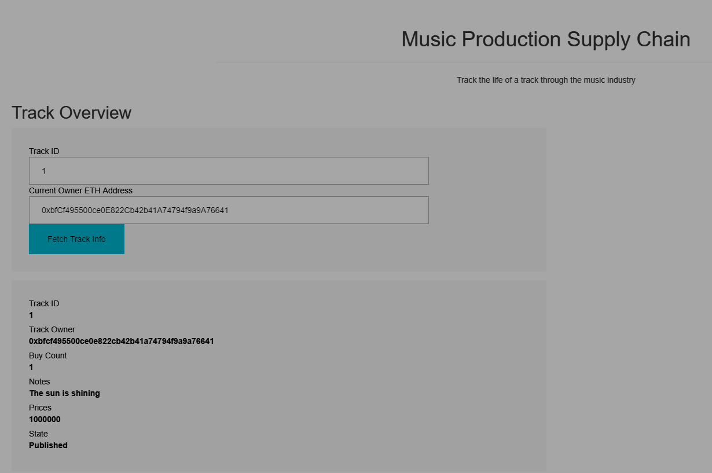
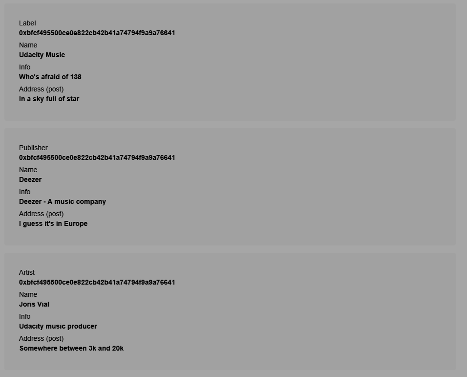
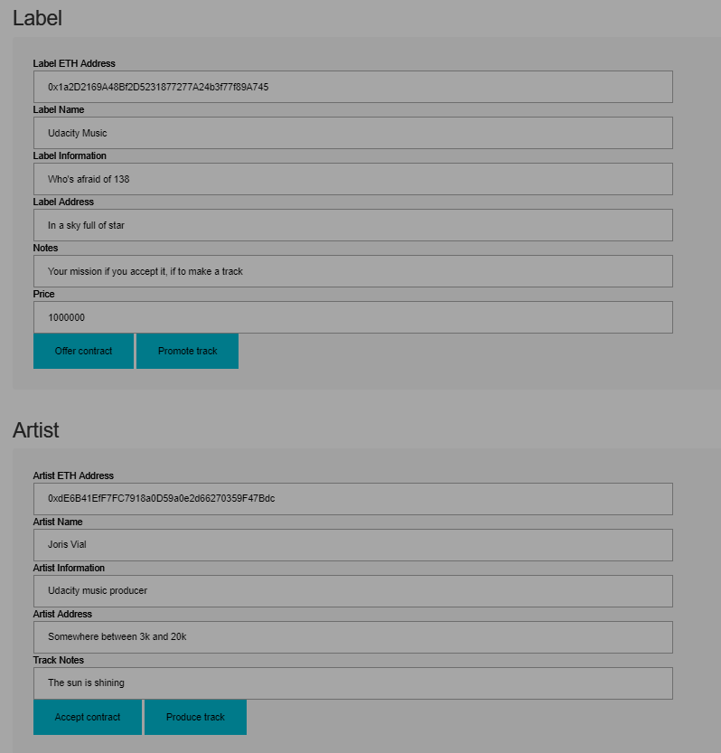
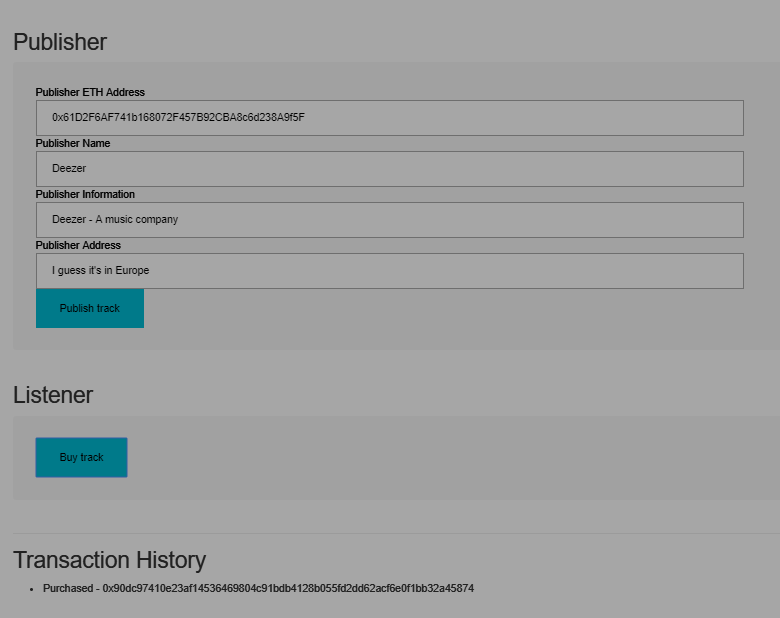
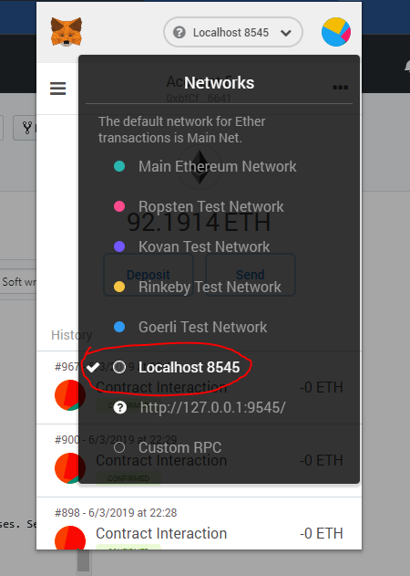
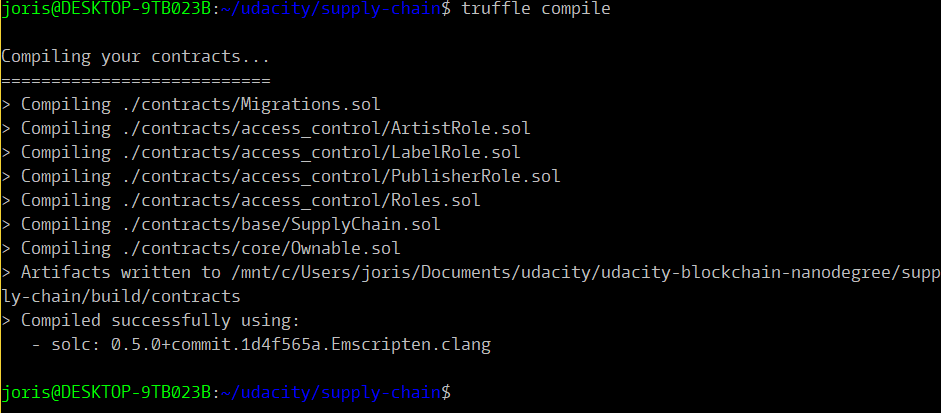
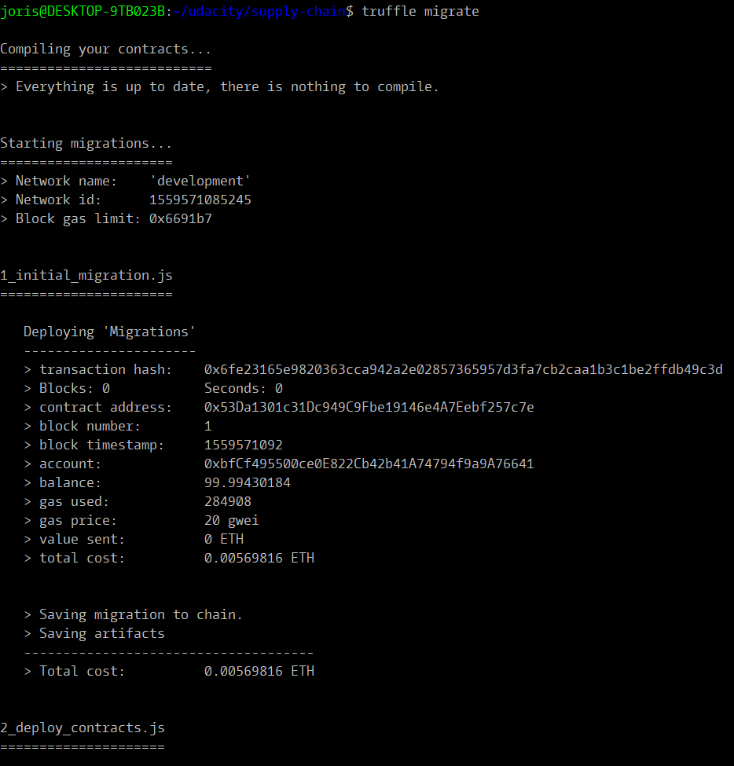
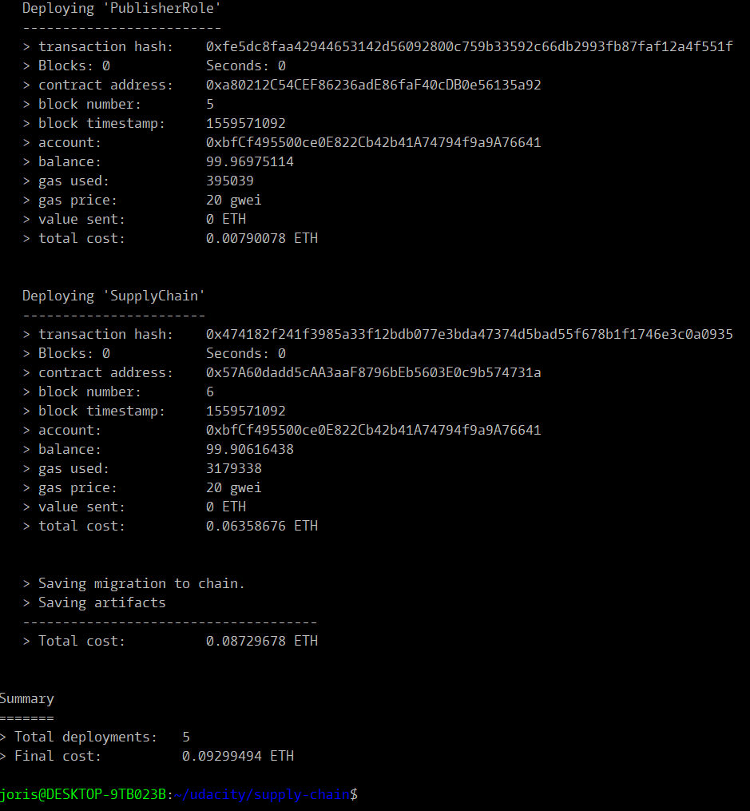
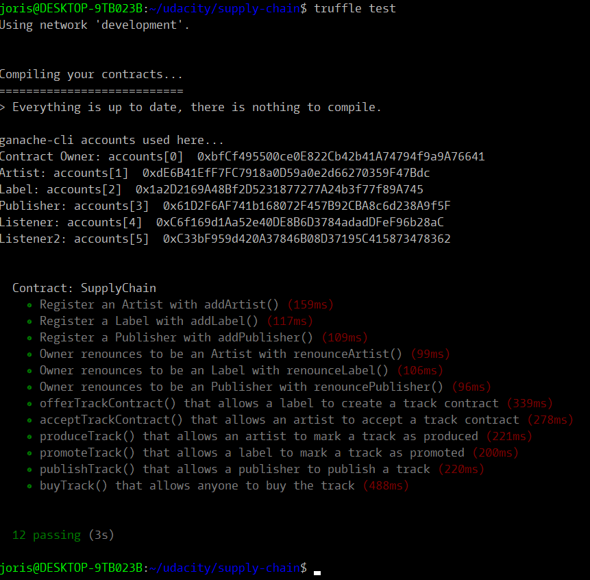

# Supply chain & data auditing

***Contract has been deployed on Rinkeby network.***
* Transaction: https://rinkeby.etherscan.io/tx/0xfdad0422f12173f9f570146e7c4fdc4c0d4d0c8a96ce47017a7b961666c1dea1
* Contract address: https://rinkeby.etherscan.io/address/0x52a8088e650e5c9b0e78333d79b42947f162346c

This repository containts an Ethereum DApp that demonstrates a Supply Chain flow for a track in the music industry. The user story is similar to any commonly used supply chain process. A label can offer contracts and promote music, artists can accept contracts and produce tracks, publisher can publish a track, and listener can buy a track.

***This is a work in progress and this project was made for learning purpose.***

The DApp User Interface when running should look like...









## Getting Started

These instructions will get you a copy of the project up and running on your local machine for development and testing purposes. See deployment for notes on how to deploy the project on a live system.

### Prerequisites

Install `ganache-cli` as well as MetaMask extension for your browser.
```
sudo npm install -g ganache-cli
```
Make sure MetaMask is connected to your local Ethereum network (through Ganache).

```
joris@DESKTOP-9TB023B:~/udacity/supply-chain$ node -v
v8.10.0
```
```
joris@DESKTOP-9TB023B:~/udacity/supply-chain$ truffle --version
Truffle v5.0.15 - a development framework for Ethereum
```



### Installing

A step by step series of examples that tell you have to get a development env running

Clone this repository:

```
git clone https://github.com/jorisvial/udacity-blockchain-nanodegree.git
```

Change directory to ```supply-chain``` folder and install all requisite npm packages (as listed in ```package.json```):

```
cd supply-chain
npm install
```

Launch Ganache:

```
ganache-cli -m "museum wrestle time describe rent enroll margin ceiling need filter paddle scrap"
```

Your terminal should look something like this:


In a separate terminal window, Compile smart contracts:

```
truffle compile
```

Your terminal should look something like this:



This will create the smart contract artifacts in folder ```build\contracts```.

Migrate smart contracts to the locally running blockchain, ganache-cli:

```
truffle migrate
```

Your terminal should look something like this:




Test smart contracts:

```
truffle test
```

All 10 tests should pass.



In a separate terminal window, launch the DApp:

```
npm run dev
```

## How to use the Front-end
* If you ran properly `ganache-cli` as explained earlier, everything is already setup
* You can test the full process in the following order (the track info are updated automatically)
  1) Label `Offer contract`
  2) Artist `Accept contract`
  3) Artits `Produce track`
  4) Label `Promote track`
  5) Publisher `Publish track`
  6) Listener `Buy track`

## Future improvemennt
* Handle multiple publishers for 1 track
* Allow actors to register/renounce
* Allow different actors to withdraw funds from the contract according to their % of track ownership
* Better UX
* Make the contract fully decentralized

## Built With

* [Ethereum](https://www.ethereum.org/) - Ethereum is a decentralized platform that runs smart contracts
* [Truffle Framework](http://truffleframework.com/) - Truffle is the most popular development framework for Ethereum with a mission to make your life a whole lot easier.


## Authors

* Udacity https://udacity.com/
* Joris Vial

## Acknowledgments

* Solidity
* Ganache-cli
* Truffle
* Udacity
